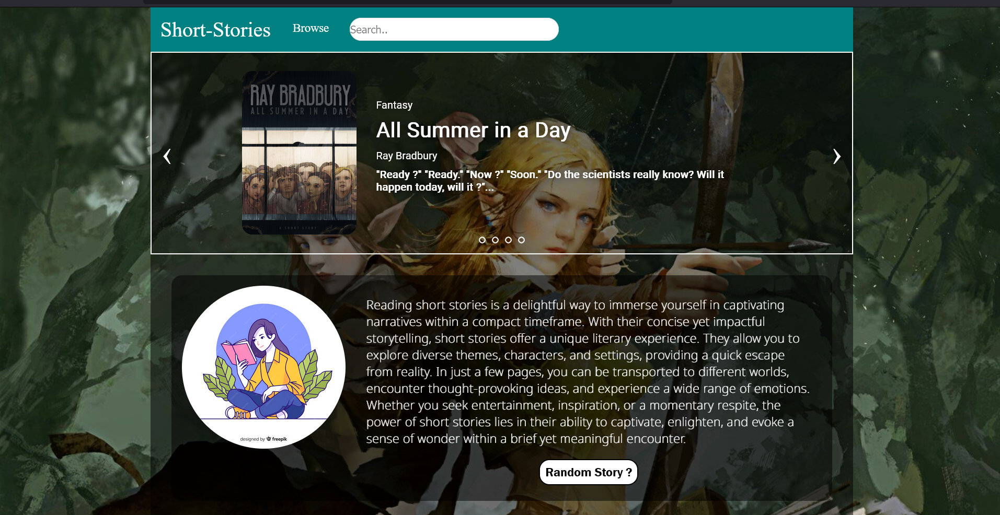

<div align="center">


<br/>

[](https://short-stories-webapp.vercel.app/)
[](https://reactjs.org/)
[](https://www.typescriptlang.org/)
[](https://vercel.com/)
[](https://aws.amazon.com/ec2/)
[](LICENSE)

<br/>

> **An immersive short story reading platform** featuring curated classic and modern stories across Fantasy, Mystery, Horror, and Philosophy — beautifully presented and cross-platform ready.

<br/>



</div>

---

## ✨ Features

| Feature | Description |
|--------|-------------|
| 📚 **Multi-Genre Library** | Curated stories across Fantasy, Mystery, Horror & Philosophy |
| 🎠 **Interactive Carousels** | Smooth genre-based story browsing experience |
| 🔍 **Search & Browse** | Navigate stories by genre with dropdown navigation |
| 📖 **Full Story Reader** | Immersive reading view for each story |
| 🌊 **Trending Section** | Highlighted banner featuring top stories |
| 📱 **Mobile Ready** | Built with Capacitor for Android deployment |
| ⚡ **Fast Loading** | Powered by Vite for lightning-fast dev & build |

---

## 🛠️ Tech Stack

<div align="center">

| Layer | Technology |
|-------|-----------|
| **Frontend** | React.js 18, JavaScript (JSX) |
| **Routing** | React Router DOM v6 |
| **Icons** | FontAwesome (Free Solid & Regular) |
| **Build Tool** | Vite |
| **Mobile** | Capacitor (Android) |
| **Hosting** | Vercel + AWS EC2 (Ubuntu) |
| **Version Control** | Git & GitHub |

</div>

---

## 📁 Project Structure

```
short-stories-webapp/
│
├── src/
│   ├── App.jsx           # Root component — fetches API & renders layout
│   ├── Nav.jsx           # Navbar with genre dropdown & search
│   ├── Trending.jsx      # Trending stories section
│   ├── Banner.jsx        # Hero banner component
│   ├── Carousel.jsx      # Genre-wise horizontal carousel
│   ├── BookCard.jsx      # Individual story card UI
│   ├── Book.jsx          # Story list/slider view
│   ├── Story.jsx         # Full story reader view
│   ├── Poster.jsx        # Promotional section
│   ├── Slider.jsx        # Slider for genre pages
│   ├── Footer.jsx        # Footer component
│   └── Data.json         # Local story data (backup)
│
├── android/              # Capacitor Android project
├── public/               # Static assets
├── index.html            # Entry HTML
├── vite.config.js        # Vite config
├── capacitor.config.json # Capacitor config
└── package.json
```

---

## 🚀 Getting Started

### Prerequisites
- Node.js `v16+`
- npm or yarn

### Installation

```bash
# 1. Clone the repository
git clone https://github.com/tinayerne04/short-stories-webapp.git

# 2. Navigate into the project
cd short-stories-webapp

# 3. Install dependencies
npm install

# 4. Start the development server
npm run dev
```

The app will be live at `http://localhost:5173` 🎉

### Build for Production

```bash
npm run build
```

### Preview Production Build

```bash
npm run preview
```

---

## 📱 Android (Capacitor)

```bash
# Sync web build to native
npx cap sync android

# Open in Android Studio
npx cap open android
```

---

## 🌐 Deployment

### Vercel (Recommended)

[](https://vercel.com/new/clone?repository-url=https://github.com/tinayerne04/short-stories-webapp)

```bash
# Or via Vercel CLI
npm i -g vercel
vercel --prod
```

### AWS EC2 (Ubuntu)

```bash
# On EC2 instance
sudo apt update && sudo apt install nginx nodejs npm -y
git clone https://github.com/tinayerne04/short-stories-webapp.git
cd short-stories-webapp
npm install && npm run build
# Serve dist/ via Nginx
```

---

## 📖 Story Genres

<div align="center">

| 🧙 Fantasy | 🔍 Mystery | 👻 Horror | 🤔 Philosophy |
|-----------|-----------|----------|--------------|
| Signs and Symbols | — | — | Hills Like White Elephants |
| All Summer in a Day | — | — | — |
| Harrison Bergeron | — | — | — |
| The Veldt | — | — | — |
| The Nothing Equation | — | — | — |

> Stories sourced from classic authors including **Ray Bradbury**, **Kurt Vonnegut**, **Ernest Hemingway**, **Vladimir Nabokov**, and more.

</div>

---

## 📊 Project Impact

<div align="center">

```
🚀  40% increase in user engagement across story genres
👥  5+ positive user reviews within the first week of launch  
🌍  45% growth in community contributions via open source
📦  Cross-platform: Web + Android (Capacitor)
```

</div>

---

## 🤝 Contributing

Contributions are what make the open-source community amazing! 🌟

```bash
# Fork the repo, then:
git checkout -b feature/your-feature-name
git commit -m "feat: add your feature"
git push origin feature/your-feature-name
# Open a Pull Request 🚀
```

**Ideas for contributions:**
- Add more story genres (Sci-Fi, Romance, Thriller)
- Implement user bookmarks / favourites
- Add dark mode toggle
- Improve search functionality
- Add story ratings & reviews

---

## 🐛 Issues

Found a bug? Have a suggestion?
👉 [Open an Issue](https://github.com/tinayerne04/short-stories-webapp/issues)

---

## 📜 License

This project is licensed under the **MIT License** — see the [LICENSE](LICENSE) file for details.

---

## 👩‍💻 Author

<div align="center">

**Tina Yerne**

[](https://www.linkedin.com/in/tina-yerne)
[](https://github.com/tinayerne04)

*Python Full-Stack Developer | React.js | AWS | DevOps*

</div>

---

<div align="center">

⭐ **If you like this project, give it a star!** ⭐

*Made with ❤️ and lots of ☕*

</div>
